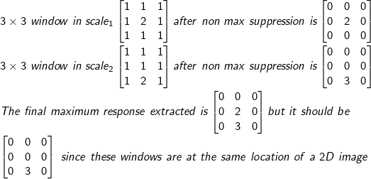
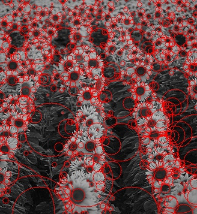

## Blob Detection

#### Desciption
Laplacian of Gaussian kernel is often used in edge detection, where edge is located at the center between a positive maximum response and a negative minimum response. Based on the analyzation that blob center is more likely at the maximum of the magnitude of the Laplacian response. With different scales of LoG kernel, there will be a case at a certain scale, the magnitude of the Laplacian response will reach a maximum comparing to other scales, which we consider the blob is located at.  

After applying multiple scales to base LoG kernel, the Laplacian response will decay since larger kernel size and larger sigma will reduce the variance of pixels in an image. A scale normalization is implemented by multiple square of sigma to the LoG kernel. The radius of a blob in pixels, is calculated as sqrt(2) times the sigma used to filter the image.

#### Problems occurred during development
Orignal:   
After filtering the image with each LoG kernel, I apply a Non-Maximum-Suppression to each filtered image with each scaled LoG kernel. Then the maximum responses are extracted from each filtered result. This will cause the Non-Maximum-Suppression doesn't suppress all non maximum values in a 3x3 window in the final global maximum signal responses.  
For Example:  
  

Problem Fixed:  
Apply dilate operation to replace local non maximum value with maximum response in a 3x3 window, then extract the global maximum reponse across all scales. Then suppress non maximum value to 0 on each layer.  

#### Results:  
  

  

  

  

#### Ref:  
Lindeberg, T. Feature Detection with Automatic Scale Selection  
Lowe, D.G. Distinctive Image Features from Scale-Invariant Keypoints